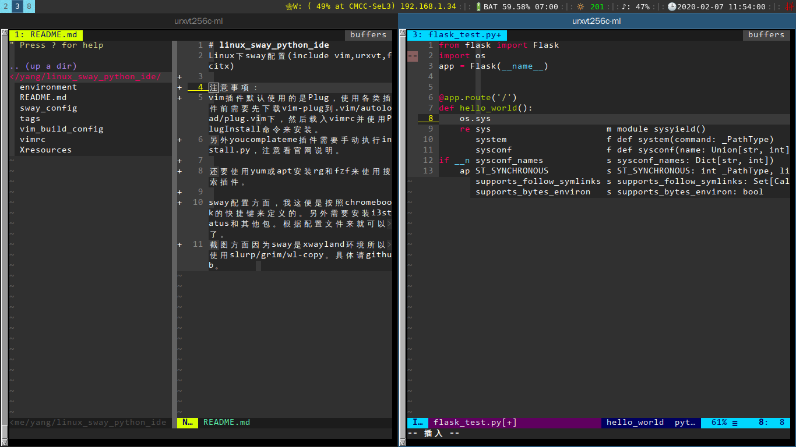

# linux_sway_python_ide
Linux下sway配置(include vim,urxvt,fcitx)

注意事项：
xterm目前用到了alacritty，原因是快速，小巧，配置简单
vim为编译安装，具体看vim_build_config文件。
另外vim插件默认使用的是[vim-plug](https://github.com/junegunn/vim-plug)，使用各类插件前需要先下载vim-plug到.vim/autoload/plug.vim下，然后载入vimrc并使用PlugInstall命令来安装。
另外youcomplateme插件需要手动执行install.py，注意看官网说明。不得不说ycm真的很强，比jedi要好很多，速度也很快。
vim-autoformat需要pip安装autopep8和flake8

还要使用yum或apt安装rg和fzf来使用搜索插件。

sway配置方面，我这里是按照chromebook的快捷键来定义的。另外需要安装i3status和其他包。根据配置文件来就可以了。
截图方面因为sway是xwayland环境所以使用slurp/grim/wl-copy。具体请github。

目前chromebook c720在fedora31和sway+chrome比较卡，换成i3wm快很多。

ps:

fzf快捷键: 

Ctrl + t (文件搜索)

Ctrl + r (历史搜索)

其他看~/.fzf/binding.bash
# linux_i3_wm_config
